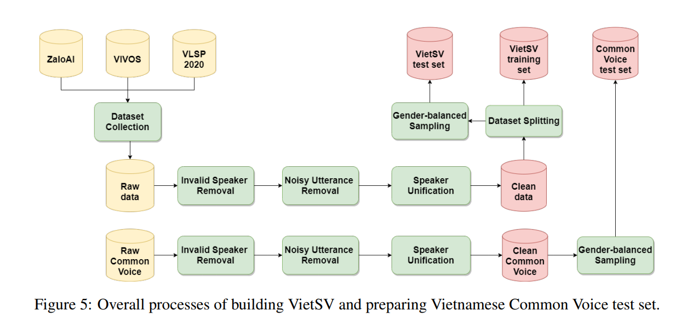
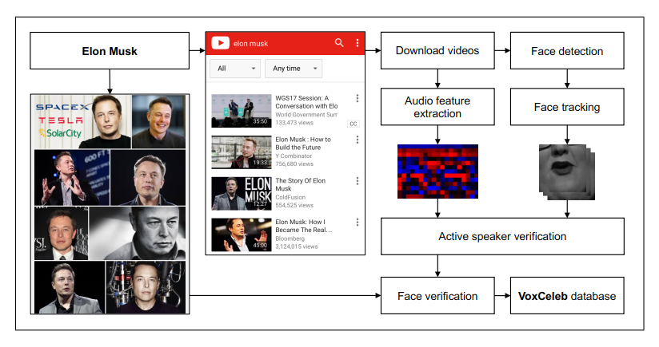

# Deep-Learning-Project-2022-1

## Pipeline: 
+ Data Preprocessing: 
  + Crawling and collecting data:
    + Youtube crawl: [lab914hust](https://github.com/lab914hust)
    + Papers:
      + [Deep Speaker Verification Model for Low-Resource Languages and Vietnamese Dataset](references/Deep%20Speaker%20Verification%20Model%20for%20Low-Resource%20Languages%20and%20Vietnamese%20Dataset.pdf)
      + [VoxCeleb a large-scale speaker identification dataset](references/VoxCeleb%20a%20large-scale%20speaker%20identification%20dataset.pdf)
  
  + Datasets:
    + [common voice](https://commonvoice.mozilla.org/en/datasets)
    
  + Use pretrained for labeling
  
  + Strategies:
    + From **Deep Speaker Verification Model for Low-Resource Languages and Vietnamese Dataset** \
    
    + Voxceleb data processing pipeline \
    
    
+ Model: 
  + References:
    + [Quick note](https://pointy-text-5bc.notion.site/Quick-Note-9b0de017dffd4682b9b2669183e2e958)
    + [ECAPA-TDNN](references/ECAPA-TDNN%20Emphasized%20Channel%20Attention,%20Propagation%20and%20Aggregation%20in%20TDNN%20Based%20Speaker%20Verification.pdf)
    + [Code](https://github.com/DungNasSa10/Asian-Multi-lingual-Speaker-Verification?fbclid=IwAR3BjVMtS_futPNMaYyQ7CmD1nkl5dpCIdR6OAbUZjTFMU7KAWbFa_FUiY0)
  
## Note about crawling data: 
Each member need to find 100+ people with as many videos per people as you want but no more than 25 minutes in total (2-5 videos per people is recommended)
